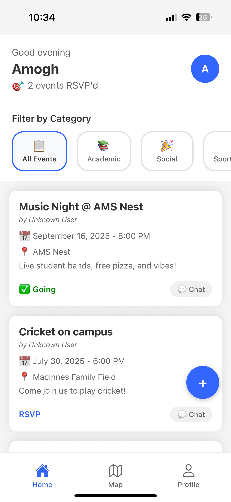
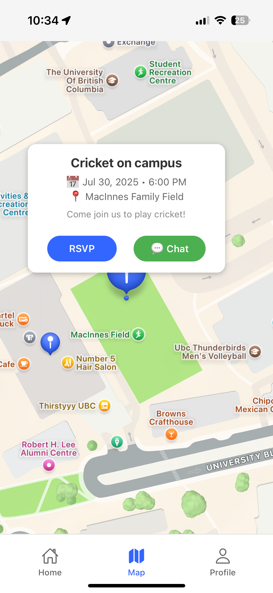
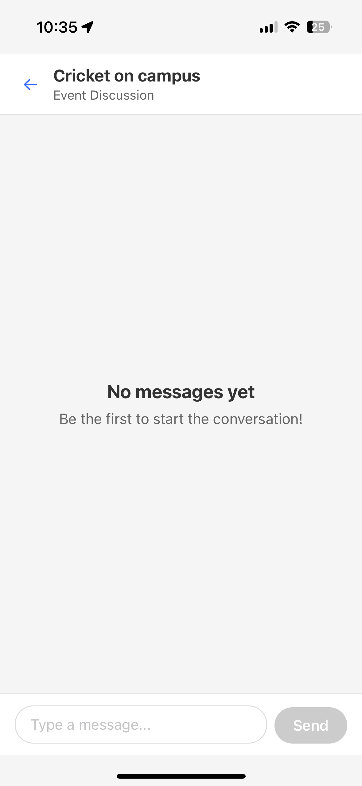
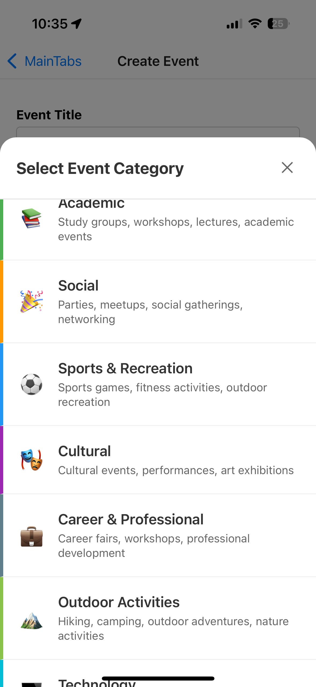
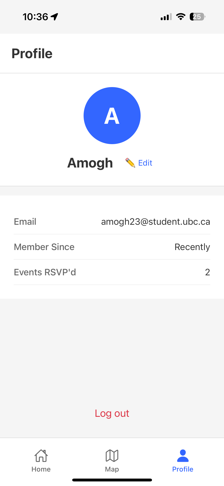

# 🎓 UniConnect

A React Native mobile application designed for UBC students to discover, create, and participate in campus events. UniConnect fosters community engagement through real-time event management, interactive maps, and social features.

## ✨ Features

### 🔐 Authentication & User Management
- **UBC Email Authentication**: Secure login using @student.ubc.ca email addresses
- **OTP Verification**: Email verification with 6-digit codes to ensure authentic UBC students
- **User Profiles**: Customizable profiles with editable names and avatars
- **Persistent Sessions**: Automatic login for returning users
- **Profile Management**: Edit personal information and view activity

### 📅 Event Management
- **Create Events**: Easy event creation with title, description, date, time, location, and category
- **Event Categories**: 12 predefined categories (Academic, Social, Sports, Cultural, etc.)
- **Interactive Location Picker**: Map-based location selection with geocoding
- **Event Editing**: Modify existing events (creator only)
- **Event Deletion**: Remove events with confirmation (creator only)
- **Real-time Updates**: Events sync across all users instantly

### 🗺️ Interactive Map
- **Event Visualization**: View all events as pins on an interactive map
- **UBC Campus Focus**: Centered on UBC campus with custom styling
- **Event Popups**: Tap pins to see event details and RSVP
- **Location Services**: Uses device GPS for current location
- **Responsive Design**: Optimized for different screen sizes

### 📍 RSVP System
- **One-Click RSVP**: Simple RSVP functionality from any screen
- **Real-time Counts**: Live RSVP counts update instantly
- **RSVP Tracking**: Personal RSVP history and statistics
- **Event Reminders**: Automatic notifications 1 hour before events
- **Creator Notifications**: Event creators notified of new RSVPs

### 💬 Real-time Chat
- **Event Discussions**: Dedicated chat rooms for each event
- **Live Messaging**: Real-time message updates across all users
- **User Identification**: Shows sender names and timestamps
- **Message Persistence**: All messages stored in Firebase
- **Auto-scroll**: Automatically scrolls to new messages

### 🔔 Push Notifications
- **Event Reminders**: Scheduled notifications 1 hour before events
- **RSVP Alerts**: Notifications when someone RSVPs to your events
- **Permission Management**: Smart permission handling
- **Cross-platform**: Works on both iOS and Android
- **Customizable**: Different notification types and schedules

### 🏷️ Event Categories & Filtering
- **12 Predefined Categories**: Academic, Social, Sports, Cultural, Career, Outdoor, Technology, Music, Food, Volunteer, Health, Other
- **Category Filtering**: Filter events by category on home screen
- **Visual Category Picker**: Modal-based category selection with icons and descriptions
- **Category Badges**: Color-coded category display on event cards
- **Category-based Browsing**: Easy discovery of events by interest

### 📱 User Experience
- **Responsive Design**: Adapts to different phone screen sizes
- **Modern UI**: Clean, intuitive interface with consistent styling
- **Loading States**: Proper loading indicators throughout the app
- **Error Handling**: User-friendly error messages and recovery
- **Offline Support**: Basic functionality without internet connection

## 🛠️ Tech Stack

### Frontend
- **React Native**: Cross-platform mobile development
- **Expo**: Development platform and build tools
- **React Navigation**: Navigation between screens
- **React Native Maps**: Interactive map functionality
- **Expo Location**: GPS and location services
- **Expo Notifications**: Push notification system

### Backend & Database
- **Firebase Authentication**: User authentication and session management
- **Firebase Firestore**: NoSQL database for real-time data
- **Firebase Security Rules**: Data access control and validation

### Development Tools
- **Expo CLI**: Development and build tools
- **React Native Debugger**: Debugging and development
- **Firebase Console**: Database management and monitoring

### Key Libraries
- **date-fns**: Date formatting and manipulation
- **react-native-geocoding**: Address to coordinates conversion
- **@react-native-community/datetimepicker**: Date and time selection

## 📱 Screenshots

### 🏠 Home Screen

*Personalized dashboard with event filtering, RSVP tracking, and quick event creation*

### 🗺️ Map Screen

*Interactive campus map with event pins and popup details for seamless event discovery*

### 💬 Event Chat Screen

*Real-time event discussions with clean interface and message persistence*

### 📝 Category Selection Modal

*Intuitive category picker with 12 predefined options and visual icons*

### 👤 Profile Screen

*User profile management with editable information and activity statistics*

## 📁 Project Structure

```
uniconnect-app/
├── components/          # Reusable UI components
│   ├── ChatMessage.js   # Individual chat message component
│   ├── EventCard.js     # Event display card
│   ├── LocationPicker.js # Map-based location selector
│   ├── CategoryPicker.js # Category selection modal
│   └── CategoryFilter.js # Category filtering component
├── config/              # Configuration files
│   └── firebase.js      # Firebase configuration
├── context/             # React Context providers
│   └── AuthContext.js   # Authentication state management
├── hooks/               # Custom React hooks
│   ├── useEvents.js     # Event data management
│   ├── useRSVP.js       # RSVP functionality
│   ├── useRSVPCount.js  # RSVP count tracking
│   └── useEventChat.js  # Chat functionality
├── navigation/          # Navigation configuration
│   └── index.js         # Main navigation setup
├── screens/             # App screens
│   ├── HomeScreen.js    # Main events list with filtering
│   ├── MapScreen.js     # Interactive map view
│   ├── ProfileScreen.js # User profile
│   ├── LoginScreen.js   # Authentication with OTP
│   ├── OTPVerificationScreen.js # Email verification
│   ├── CreateEventScreen.js # Event creation with categories
│   ├── EditEventScreen.js   # Event editing
│   └── EventChatScreen.js   # Event discussions
├── services/            # External services
│   ├── NotificationService.js # Push notifications
│   └── EmailVerificationService.js # OTP verification
├── utils/               # Utility functions
│   ├── validators.js    # Input validation
│   ├── categories.js    # Event categories configuration
│   └── rsvpUtils.js     # RSVP utilities
└── App.js               # Main app component
```

---

**Built with ❤️ for the UBC community**
